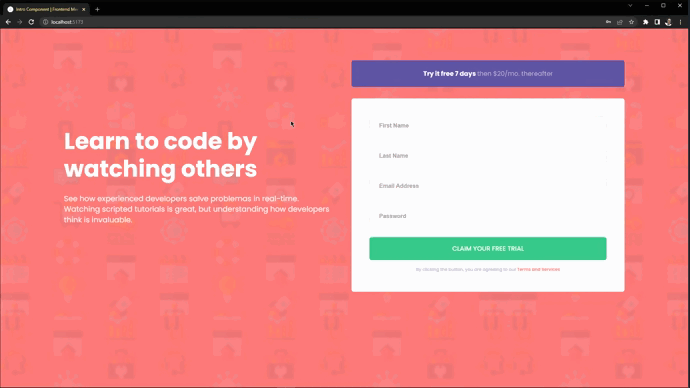
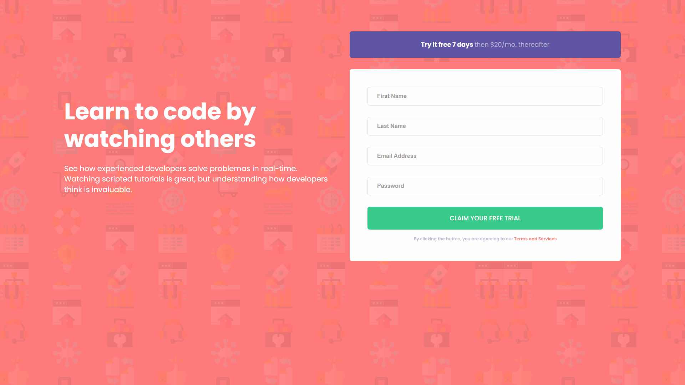
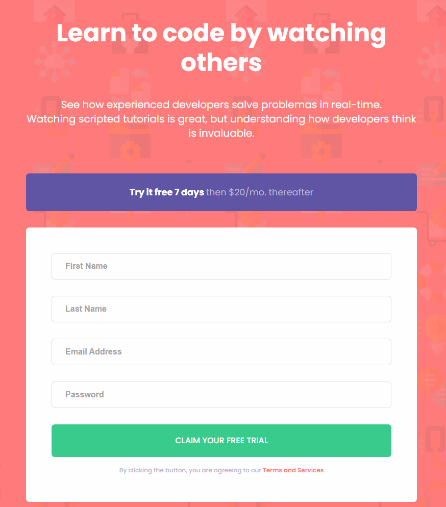
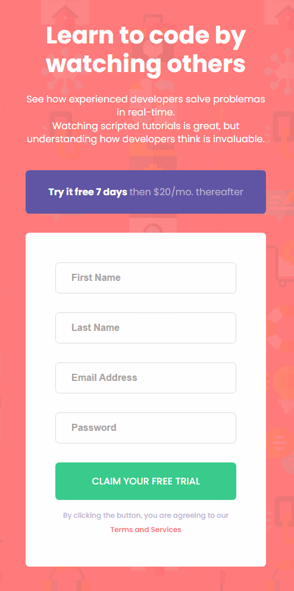

# Frontend Mentor - Intro component with sign up form solution

This is a solution to the [Intro component with sign up form challenge on Frontend Mentor](https://www.frontendmentor.io/challenges/intro-component-with-signup-form-5cf91bd49edda32581d28fd1). Frontend Mentor challenges help you improve your coding skills by building realistic projects. 

## Table of contents

- [Overview](#overview)
  - [The challenge](#the-challenge)
  - [Screenshot](#screenshot)
  - [Links](#links)
- [My process](#my-process)
  - [Built with](#built-with)
  - [What I learned](#what-i-learned)
  - [Continued development](#continued-development)
  - [How to use the project](#how-to-use-the-project)
- [Author](#author)

## Overview

### The challenge

Users should be able to:

- View the optimal layout for the site depending on their device's screen size
- See hover states for all interactive elements on the page
- Receive an error message when the `form` is submitted if:
  - Any `input` field is empty. The message for this error should say *"[Field Name] cannot be empty"*
  - The email address is not formatted correctly (i.e. a correct email address should have this structure: `name@host.tld`). The message for this error should say *"Looks like this is not an email"*

### Screenshot







### Links

- Solution URL: [Github](https://github.com/gustavomarim/intro-component-react)
- Live Site URL: [Vercel](https://intro-component-react.vercel.app)

## My process

### Built with

- Semantic HTML5 markup
- CSS custom properties
- Flexbox
- CSS Grid
- Mobile-first workflow
- [React](https://reactjs.org/) - JS library
- [ESLint](https://eslint.org) - Find and fix JS problems


### What I learned

In this project I was able to put into practice my learning in React, using concepts of good software development practices, reuse of library components, semantic HTML and responsive CSS. I also had the opportunity to implement a project standardization with ESLint and validation of form fields through Regex.

### Continued development

Continuarei aperfeiçoando as técnicas de boas práticas de desenvolvimento de software, utilização de react na construção de aplicações e boas práticas de UI/UX.

### How to use the project

### Prerequests

Before starting, you will ned to have the following tools installed on your machine:
[Git](https://git-scm.com), [Node.js](https://nodejs.org/en/). 
Besides, it's good to have an editor to work with the code like [VSCode](https://code.visualstudio.com/)

### 🎲 Running on localhost

```bash
# Clone this repository
$ git clone https://github.com/gustavomarim/intro-component-react.git

# Go to project folder in terminal/cmd
$ cd intro-component-react

# Install the dependencies
$ npm install

# Run the application in development mode
$ npx vite/npm run dev

# The project will run on your local default port or port: 3000 - access <http://localhost:3000>
```

## Author

- Github - [Gustavo dantas](https://github.com/gustavomarim)
- Frontend Mentor - [@gustavomarim](https://www.frontendmentor.io/profile/gustavomarim)

